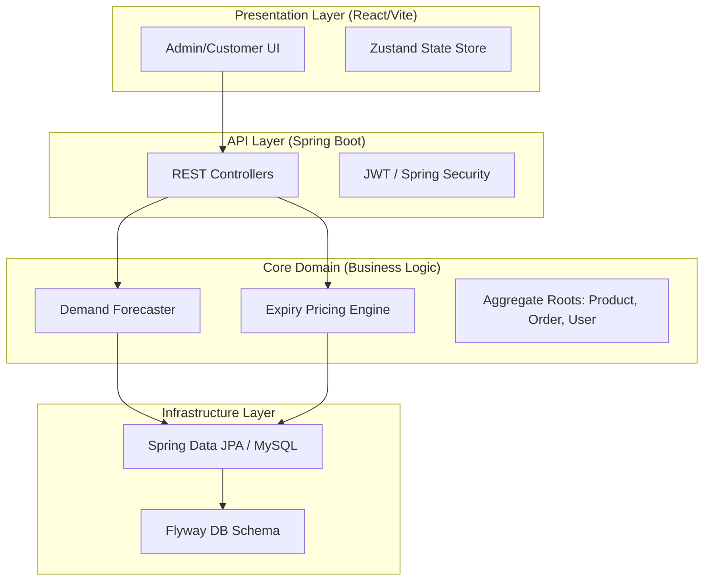

# 🍃 FreshFlow Dynamics
### *Enterprise-Grade Perishable Inventory & Dynamic Pricing Intelligence*

[](https://github.com/Abdurrehman510/FreshFlow-Dynamics)
[](https://martinfowler.com/tags/domain%20driven%20design.html)
[](#tech-stack)

---

## 📖 Executive Summary

**FreshFlow Dynamics** is an advanced supply chain platform engineered to eliminate the multi-billion dollar wastage problem in the perishable goods industry. Unlike generic POS systems, FreshFlow integrates a **High-Frequency Dynamic Pricing Engine** and **Weighted Demand Forecasting** to transform expiring inventory into recovered capital.

The platform is architected using **Domain-Driven Design (DDD)** and **Clean Architecture**, ensuring a decoupled, testable, and enterprise-ready codebase that adheres to strict industry standards.

---

## ⚙️ Core Innovations

### 1. Dynamic Pricing Engine (DPE)
The DPE is the platform's primary value driver. It automates economically rational markdowns based on the decaying utility of perishable goods.

> [!TIP]
> **Logic Flow**: The engine runs a nightly batch job that evaluates every product's shelf-life against pre-defined risk tiers.

| Time to Expiry | Discount | Business Rationale |
|:--- |:--- |:--- |
| **> 5 Days** | 0% | Premium fresh stock; standard margins. |
| **4–5 Days** | 10% | Early-stage velocity acceleration. |
| **2–3 Days** | 25% | Aggressive markdown to clear mid-tier stock. |
| **1 Day** | 50% | Liquidation pricing to minimize total loss. |
| **Same Day** | 70% | Final clearance; prioritizes wastage avoidance. |

### 2. Weighted Moving Average (WMA) Forecasting
Replacing "gut-feeling" ordering with data science. The engine uses a **30-day WMA algorithm** with recency weighting to predict demand spikes.

- **Recency Bias**: Weights linearly increase from Day 30 ($w=1$) to Day 1 ($w=30$).
- **Trend Detection**: Compares trailing 7-day averages against previous cycles to identify `INCREASING`, `STABLE`, or `DECREASING` demand.
- **Spike Sensitivity**: Features an automated alert system when demand exceeds 1.5x the 30-day moving average.

---

## 🏗️ System Architecture

The project follows a strict **Hexagonal / Ports & Adapters** style to ensure the core business logic remains independent of external frameworks.



---

## 🛠️ Tech Stack

<table style="width:100%">
  <tr>
    <th width="50%">Backend (Java/Spring)</th>
    <th width="50%">Frontend (React/Modern JS)</th>
  </tr>
  <tr>
    <td>
      <ul>
        <li><b>Java 17</b> & Spring Boot 3.2</li>
        <li><b>Spring Security:</b> JWT-based auth & BCrypt</li>
        <li><b>Persistence:</b> Hibernate & MySQL 8.0</li>
        <li><b>Migrations:</b> Flyway (Versioned SQL)</li>
        <li><b>Validation:</b> JSR-380 Hibernate Validator</li>
      </ul>
    </td>
    <td>
      <ul>
        <li><b>React 18:</b> Functional Components & Hooks</li>
        <li><b>Vite:</b> Ultra-fast HMR Build Tool</li>
        <li><b>Tailwind CSS:</b> Utility-first styling</li>
        <li><b>Recharts:</b> Complex demand visualization</li>
        <li><b>Zustand:</b> Lightweight state management</li>
      </ul>
    </td>
  </tr>
</table>

---

## 📊 Data Schema

FreshFlow utilizes a highly relational and optimized schema to track every state change in a product's lifecycle.

| Entity | Primary Responsibility |
|:--- |:--- |
| **User** | Role-based access (Admin/Owner/Customer) & wallet management. |
| **Product** | Tracks dynamic price, expiry timestamps, and wastage metrics. |
| **Order** | Immutable record of sales, applying real-time dynamic discounts. |
| **Wastage** | Audit trail for expired inventory, feeding the loss-analytics engine. |
| **Supplier** | Procurement routing and automated reorder triggers. |

---

## 🚦 Getting Started

### 📦 Backend Setup
1. Ensure **MySQL** is running and create `perishable_platform`.
2. Configure credentials in `backend/.../application.properties`:
   ```properties
   spring.datasource.password=${DB_PASSWORD:your_pwd}
   ```
3. Boot the API:
   ```bash
   cd backend
   mvn spring-boot:run
   ```

### 💻 Frontend Setup
1. Navigate to the frontend directory:
   ```bash
   cd frontend
   npm install
   npm run dev
   ```

---

## 🤝 Contact & Hire
I am always open to discussing new opportunities or technical deep-dives into this project.

- **Name**: Abdurrehman
- **GitHub**: [Abdurrehman510](https://github.com/Abdurrehman510)
- **Email**: [abdurrehman.work@gmail.com](mailto:abdurrehman.work@gmail.com)
- **LinkedIn**: [linkedin.com/in/abdurrehman](https://www.linkedin.com/in/abdurrehman)

---
*Developed with ❤️ to build a more sustainable and efficient supply chain.*
