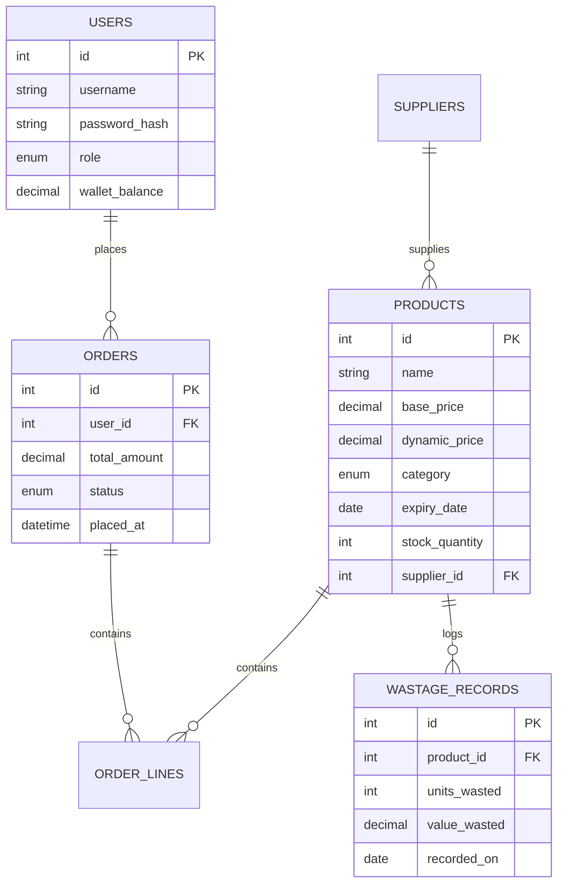

# 🗄️ Database Schema: FreshFlow Dynamics

FreshFlow uses a MySQL 8.0 relational database with normalized structures to maintain data integrity and support complex analytics.

## 📐 Entity Relationship Diagram

## 📋 Table Definitions

### `products`
The core table. Note the distinction between `base_price` (admin set) and `dynamic_price` (engine set).
- **Index**: `idx_products_expiry` on `expiry_date` is critical for the nightly repricing job.
- **Search**: `FULLTEXT` index on `name` and `description`.

### `users`
Supports RBAC (Role-Based Access Control) and virtual wallet calculations.
- **Constraints**: `username` is unique.

### `wastage_records`
A snapshot-based table. It stores `product_name` and `value_wasted` at the time of incident to ensure reporting remains valid even if a product is deleted or its price changes.

## 🚀 Migrations
Schema changes are managed via **Flyway**.
- Scripts are located in: `backend/src/main/resources/db/migration`
- Baseline: `V1__initial_schema.sql`
